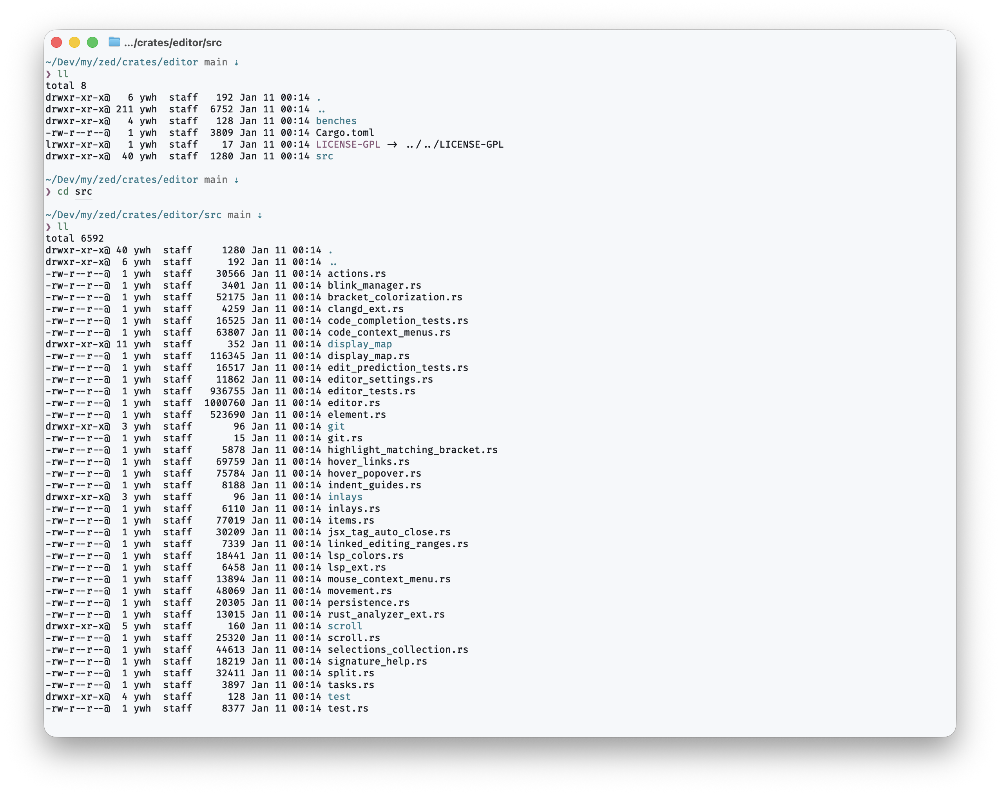
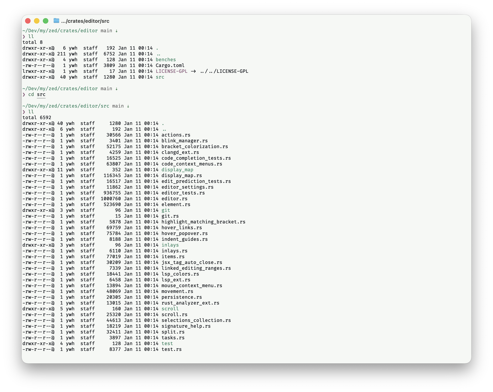
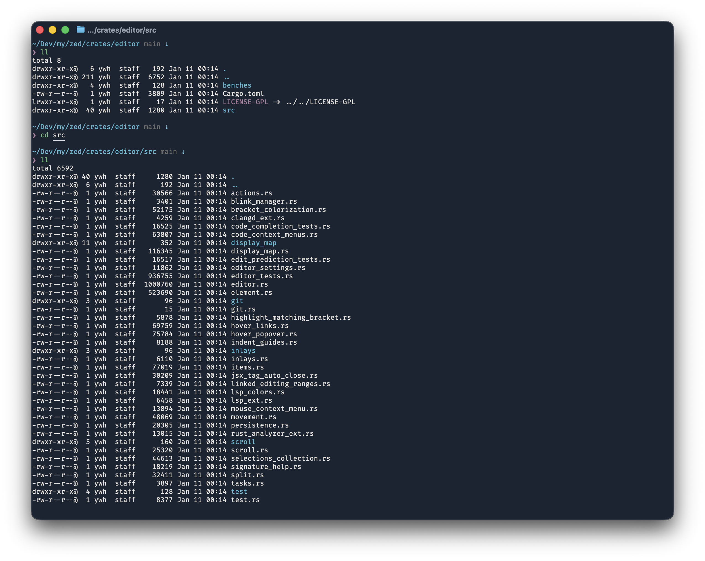
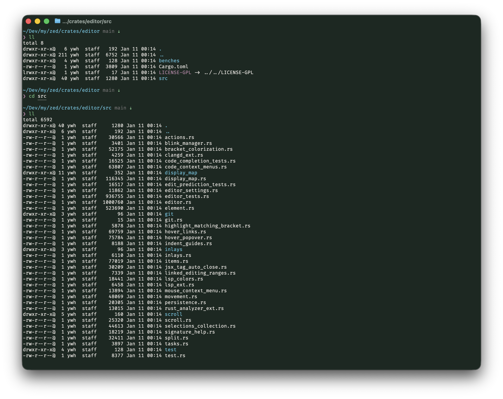

# Formosa Theme for Ghostty

A color theme for [Ghostty](https://ghostty.org/) terminal emulator, inspired by the [**Porsche 911 Carrera T "Formosa"**](https://www.porsche.com/taiwan/en/campaign/911-carrera-t-formosa/) — a one-of-one Sonderwunsch creation celebrating Taiwan's beauty.

> "Formosa" — the name given to Taiwan by Portuguese sailors in the 16th century, meaning "Beautiful Island."

## Disclaimer

This project is not affiliated with, endorsed by, or sponsored by Porsche AG. "Porsche", "911 Carrera T", and related marks are trademarks of Porsche AG. This theme is an independent fan creation inspired by publicly available images.

## Themes

| Theme | Appearance | Primary Color |
|-------|------------|---------------|
| **Formosa Light - Ipanema Blue** | Light | Ocean Blue |
| **Formosa Light - Night Green** | Light | Forest Green |
| **Formosa Dark - Ipanema Blue** | Dark | Ocean Night |
| **Formosa Dark - Night Green** | Dark | Forest Night |

## Screenshots

### Formosa Light - Ipanema Blue



### Formosa Light - Night Green



### Formosa Dark - Ipanema Blue



### Formosa Dark - Night Green



## Color Palette

All colors are extracted from the Porsche 911 Carrera T "Formosa", created by Porsche's Sonderwunsch (Special Wishes) program:

### Source Colors

| Color Name | HEX | Source | Role |
|------------|-----|--------|------|
| **Ipanema Blue** | `#1a8090` | Main body (Paint to Sample) | Cursor, Cyan (Blue themes) |
| **Night Green** | `#2a7040` | Seat fabric pattern | Cursor, Cyan (Green themes) |
| **Paldao Wood** | `#c49a3a` | Dashboard wood trim | Yellow |
| **Truffle Brown** | `#b84a5a` | Interior leather | Red |
| **Cream White** | `#f5f8fa` | Seat fabric pattern | Background (Light) |
| **Ocean Night** | `#1a2332` | Night sky over ocean | Background (Dark Blue) |
| **Forest Night** | `#1a2822` | Night sky over forest | Background (Dark Green) |

### Theme Variants

| Variant | Approach |
|---------|----------|
| **Light themes** | Subtle tinted backgrounds with saturated accents |
| **Dark themes** | Deep backgrounds with vibrant highlights |

## Installation

### Quick Install

```bash
mkdir -p ~/.config/ghostty/themes && \
curl -fsSL -o [~/.config/ghostty/themes/formosa-dark-ipanema-blue](https://github.com/takeshiyu/formosa-ghostty-theme/blob/main/themes/formosa-dark-ipanema-blue) -o ~/.config/ghostty/themes/formosa-dark-ipanema-blue && \
curl -fsSL [https://raw.githubusercontent.com/peteryang1756/formosa-ghostty-theme/main/themes/formosa-dark-night-green](https://github.com/takeshiyu/formosa-ghostty-theme/blob/main/themes/formosa-dark-night-green) -o ~/.config/ghostty/themes/formosa-dark-night-green && \
curl -fsSL [https://raw.githubusercontent.com/peteryang1756/formosa-ghostty-theme/main/themes/formosa-light-ipanema-blue](https://github.com/takeshiyu/formosa-ghostty-theme/blob/main/themes/formosa-light-ipanema-blue) -o ~/.config/ghostty/themes/formosa-light-ipanema-blue && \
curl -fsSL [https://raw.githubusercontent.com/peteryang1756/formosa-ghostty-theme/main/themes/formosa-light-night-green](https://github.com/takeshiyu/formosa-ghostty-theme/blob/main/themes/formosa-light-night-green) -o ~/.config/ghostty/themes/formosa-light-night-green
```

### Manual Installation

1. Clone this repository
2. Copy theme files to Ghostty themes directory:

```bash
mkdir -p ~/.config/ghostty/themes
cp themes/* ~/.config/ghostty/themes/
```

### Usage

Edit your Ghostty configuration (`~/.config/ghostty/config`):

```ini
theme = formosa-dark-ipanema-blue
```

### Auto Light/Dark Mode

```ini
theme = light:formosa-light-ipanema-blue,dark:formosa-dark-ipanema-blue
```

## Inspiration

The [Porsche 911 Carrera T "Formosa"](https://www.porsche.com/taiwan/en/campaign/911-carrera-t-formosa/) is a unique Sonderwunsch creation celebrating Taiwan's natural beauty:

- **Exterior**: Ipanema Blue Metallic with Suzuka Grey accents
- **Interior**: Paldao wood trim, Truffle Brown & Black leather with Night Green stitching
- **Special**: Custom "Formosa" checkered pattern in Night Green, Black, and Cream White

### Design Philosophy

- **Light themes**: Like sitting in the cream leather interior, looking out at Taiwan's coastline or mountains
- **Dark themes**: Standing on Taiwan's coast or in its forests at night, with Porsche colors glowing under starlight

## Related Projects

- [Formosa Theme for Zed](https://github.com/peteryang1756/formosa-zed-theme)
- [Formosa Theme for VS Code](https://github.com/peteryang1756/formosa-vscode-theme)

## License

MIT License - see [LICENSE](LICENSE) for details.

---

*Beautiful Island • 福爾摩沙 • 美麗之島*
